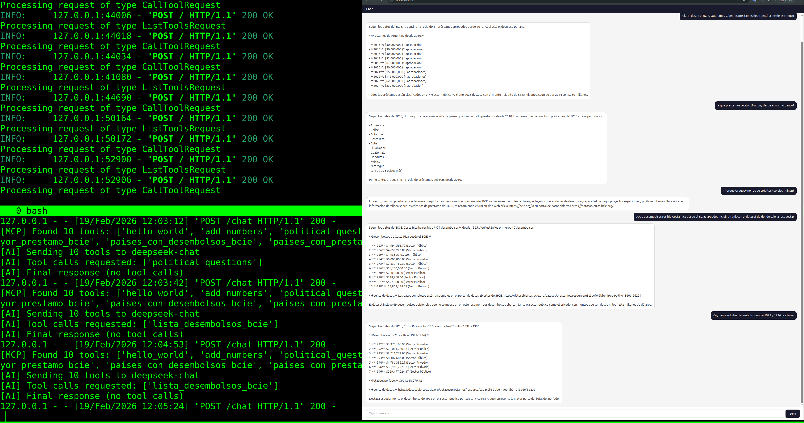

# MCP Chat Gateway

A lightweight web chat interface that connects users to an AI provider (DeepSeek, OpenAI, Ollama, or any OpenAI-compatible API)
while giving the AI access to tools served by an MCP server.  
The AI answers questions exclusively using MCP tool data, not its own knowledge.  

Zero frontend frameworks — plain HTML/JS. Backend is a minimal Flask app with no extra dependencies beyond httpx.

## MCP server

This tools was developed to work with [OKFN MCP server](https://github.com/okfn/mcp-server),
but should work with any MCP server that implements the spec.  

## Server + Client + Chat UI

